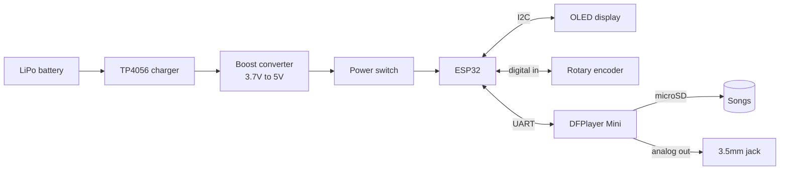

# ESP32 MP3 Player

A no-soldering, breadboard-based portable MP3 player built around an ESP32: a rotary-encoder interface, an OLED status screen, local playback off a microSD card, and extras like EQ presets, shuffle, a web dashboard and OTA firmware updates — three units built, one of them (nicknamed "Spider") fully finished and in a case.

Built by SuperDidZero (PC Build PT), with two friends building their own units alongside — a genuine beginner electronics project: nobody involved had done hardware wiring before this.

All WiFi credentials, personal emails and other identifying details have been removed from these docs. Everything else — parts, costs, pin assignments, and especially the mistakes — is real.

## What's in here

| Doc | Covers |
|---|---|
| [docs/parts-list.md](docs/parts-list.md) | The full bill of materials, what it cost, and the sourcing decisions behind it |
| [docs/wiring.md](docs/wiring.md) | Pin assignments and the power chain — including a batch-wide hardware gotcha that will save you hours |
| [docs/firmware-and-features.md](docs/firmware-and-features.md) | What the finished unit actually does, and the build order that avoids the worst bugs |
| [docs/lessons-learned.md](docs/lessons-learned.md) | Every real failure hit along the way and how it was diagnosed — the most useful page in this repo |

## Rough signal/power chain

## Why this is public

Most "I built a thing with an ESP32" write-ups skip the part where it almost didn't work. This one keeps that part in: a charger board with its polarity labels silkscreened backwards (confirmed across an entire batch, not a one-off), a board that looked bricked but was actually one wrong setting in the IDE, a battery and USB fighting each other and corrupting the flash. If you're sourcing the same cheap modules, the [lessons-learned](docs/lessons-learned.md) page alone could save you a very confusing evening.

Related: [command-console](https://github.com/superdidotwitch-jpg/command-console) and [homelab-v2](https://github.com/superdidotwitch-jpg/homelab-v2) — separate projects, same author.

## License

MIT. Do whatever you want with it.
