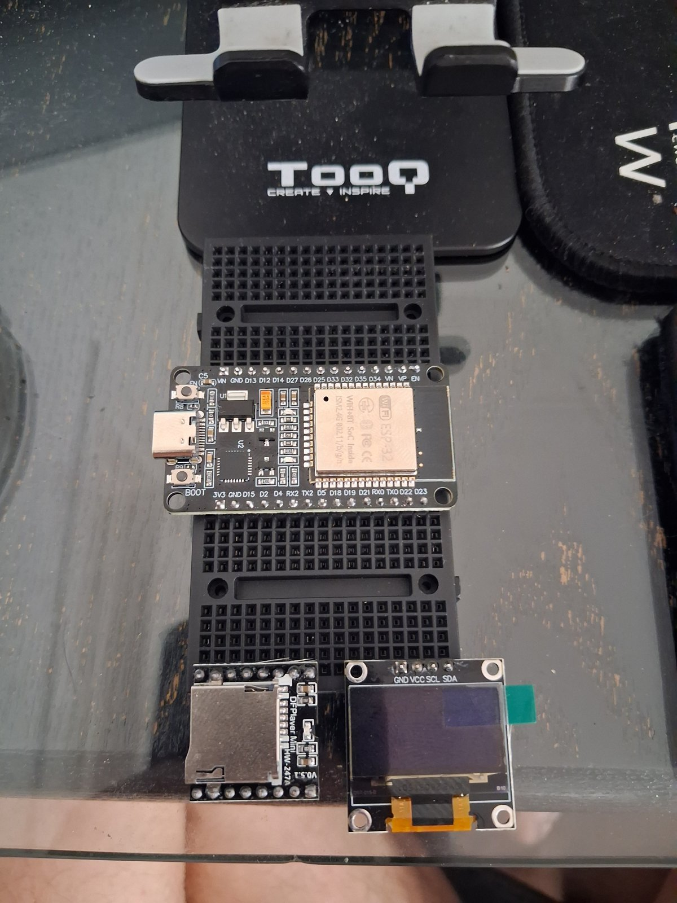
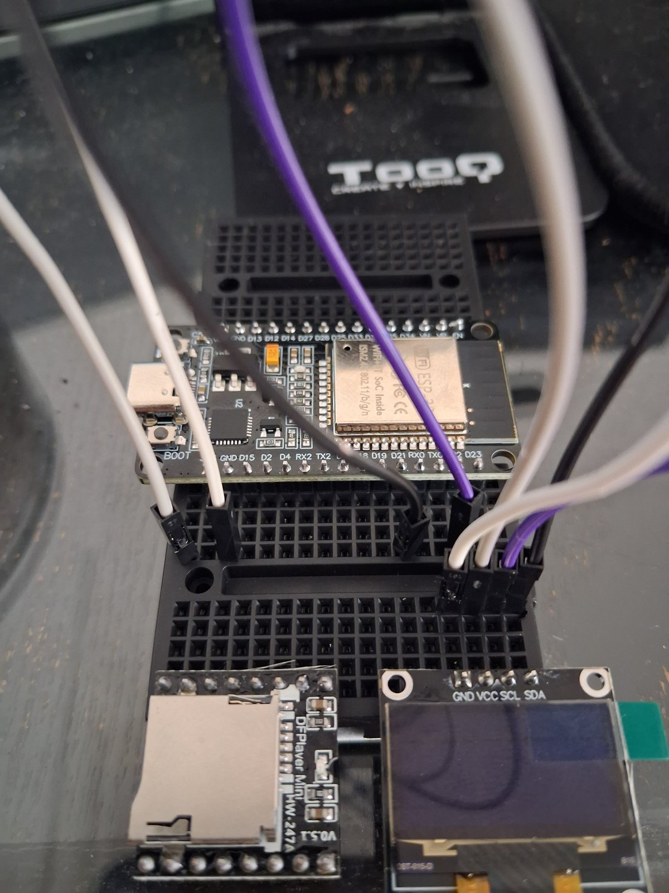
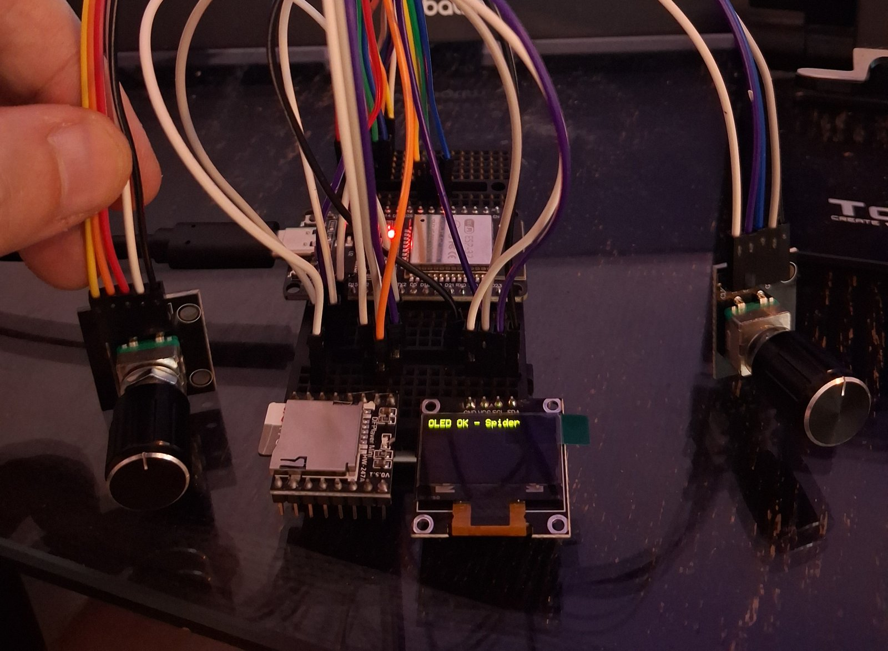
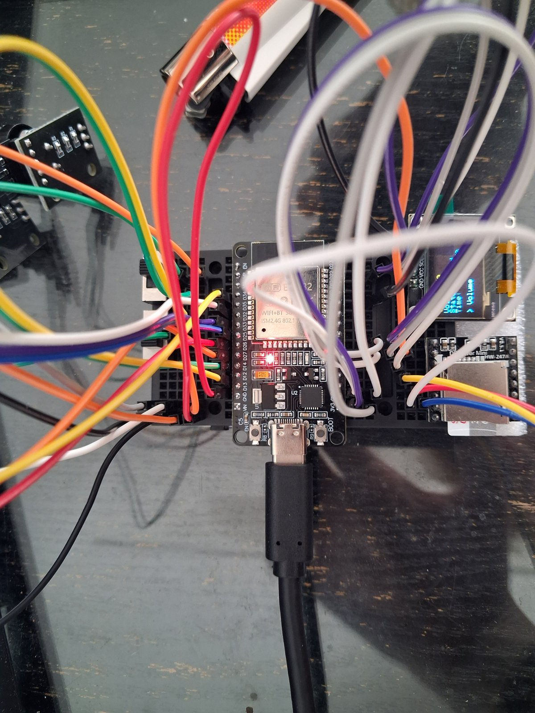
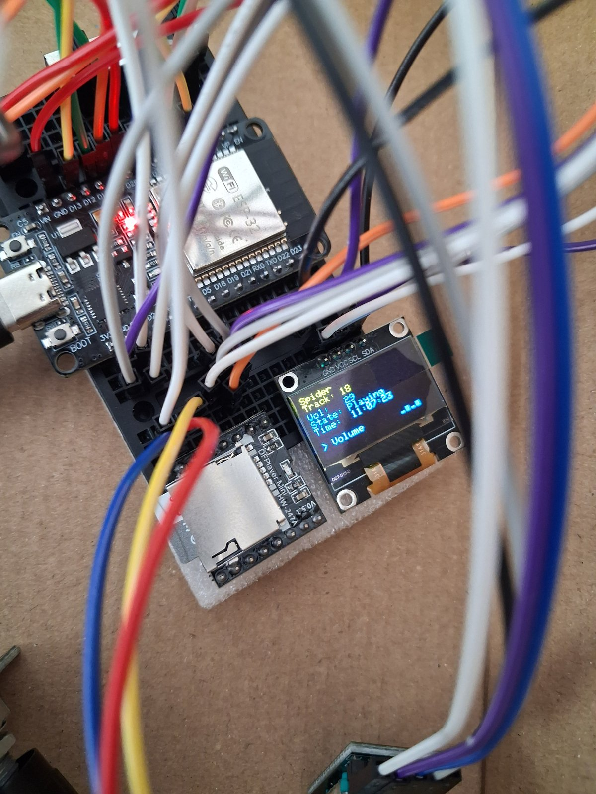

# Photos

Pictures of the real builds.

## Spider

The build in order, from loose parts to the finished case.

*24 September 2026.* Where it started: the ESP32 on two mini breadboards, with the DFPlayer Mini and the OLED screen below it. Nothing is wired yet.

*24 September 2026.* The first jumper wires going in for the screen and the player.

*24 September 2026.* The first sign of life. The screen reads "OLED OK - Spider" and both rotary encoders are connected and being tested.

*25 September 2026.* The breadboard from above with everything wired: the two encoders off to the left, the screen and the player on the right, power coming in over USB-C.

*1 October 2026.* Playing. The screen shows the track number, volume, state and the clock, with the small moving bars in the corner while music plays.

*October 2026.* Spider in its cardboard case, on the day the case was built. The two encoder knobs go through the side wall, the 3.5mm jack pokes through the front, and the ESP32 sits under the jumper wires across the two breadboards. The glue gun in the background is what holds it all together.

## Still to add

- The one-knob unit (Octopus)
- The perfboard build, when it happens
