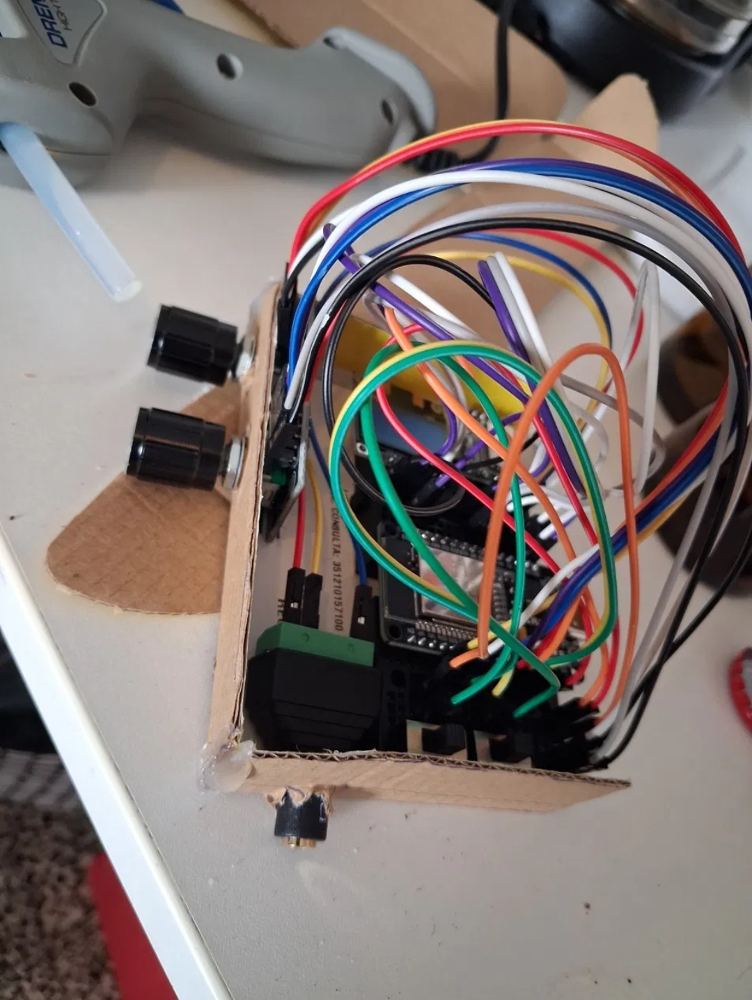

# Photos

Pictures of the real builds.

## Spider

*October 2026.* Spider in its cardboard case, on the day the case was built. The two encoder knobs go through the side wall, the 3.5mm jack pokes through the front, and the ESP32 sits under the jumper wires across the two breadboards. The glue gun in the background is what holds it all together.

## Still to add

- Spider finished, with the screen on while it plays
- The two breadboards from above, with the wiring visible
- The other units
